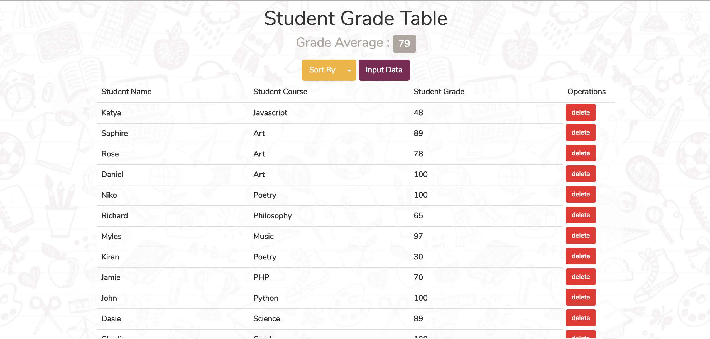
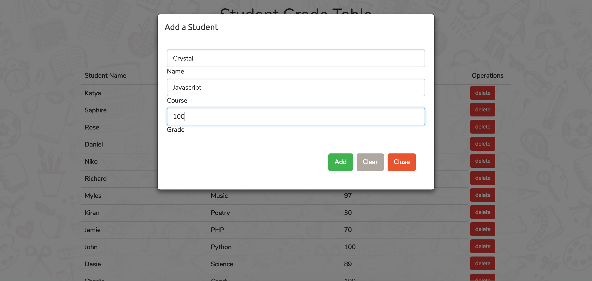
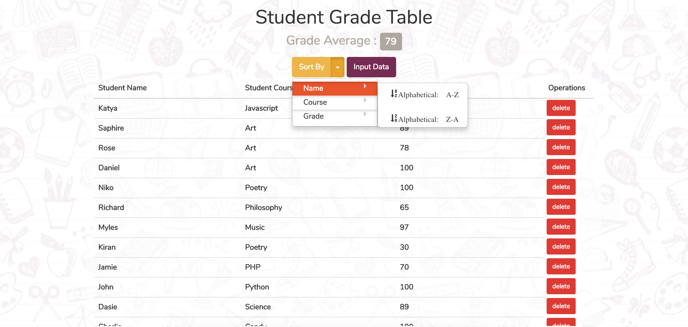
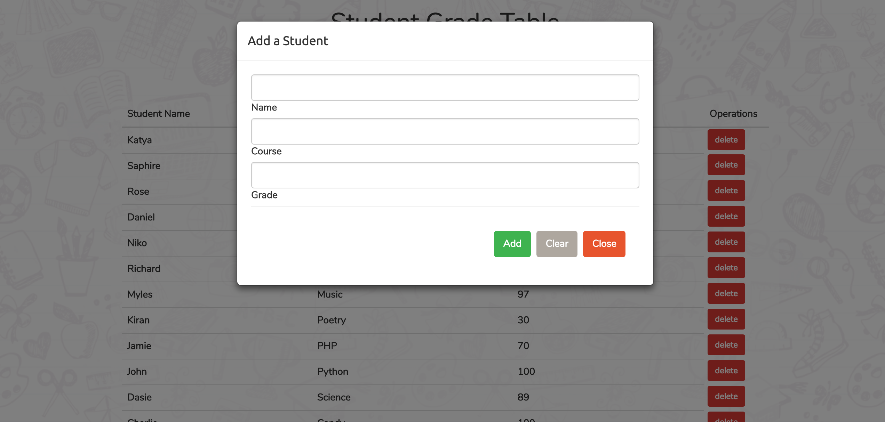

# SGT - Student Grade Table

- <a href="sgt.crystalnavarro.com">Live link here</a>

## Student Grade Table is a CMS that utilizes the basic functionality of persistant storage: CRUD (Create, Read, Update, Delete). A student or teacher can use this web application to keep track of grades and courses. Its UI is with HTML5 and Bootstrap. Javascript's jQuery library was used to manipulate the DOM as well as handle AJAX calls to the Node.js server. The Node.js server handles all the queries made to the mySQL database. 

## Technologies Used: 
HTML5
CSS3
Bootstrap 3
Javascript
jQuery
Node.js
MySQL

